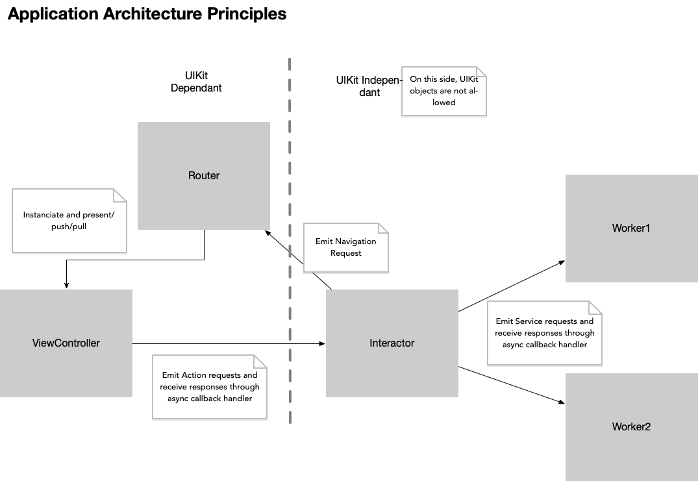

# Installation

Put your OpenWeatherAPI AppID in the Info.plist, in the `OpenWeatherAPPID` Key

# Architecture

# Dependencies

Every arrows in the graph describe a dependency from one object to another.
All of them are defined by an abstraction protocol, so the object pointed could be replaced by any other one respecting the same protocol.  This allows :
- Easy mocking for unit testing
- Changing the implementation details without changing the caller (So for ex: Changing a Storage Worker from UserDefault to SQLite) 

# Separation of responsibilities

The clear separation between UIKiT-Dependant / UIKit-Indepenpant objects leaves ViewControllers and Routers to be the only ones allowed to ìmport `UIKit`. This rule should insurred by carefull code reviews. The purpose of this constraint is to allow same interactors and workers to run on other platforms (iPads, watches, tvs) without any modifications. 
Interactor is the App Logic, tt should not depends on display issue.

In Many books, a Presenter object is also included. It's role is transforming datas given by the interactor, next to be presented by the view layer (by producing a viewModel structure). The presenter should also be on the UIKit agnostic side, and since it is so tighly coupled with his interactor outputs, it seems ok i think, at least temporarly, to fusionate Presenter in Interactor to have one object with both responsibilities (But i keep the notion of ViewModel structure as a way to transmit datas to View layer.

